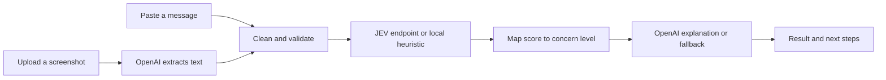

<div align="center">

# ScamShield

### A clearer next step for a suspicious message.

Upload. Analyze. Understand. Verify.

Check screenshots and pasted messages for common scam warning signs,<br />
with explanations designed for everyday decisions.


[Overview](#overview) · [Quick start](#quick-start) · [Architecture](#architecture) · [Contributing](#contributing)

</div>

---

## Overview

An urgent payment request. An unexpected prize. A message asking for your OTP. ScamShield is being built to help people pause, recognize warning signs, and decide what to verify before taking action.

The application combines screenshot text extraction, structured risk analysis, and plain-language explanations, with Filipino consumers in mind. Results use three concern levels and practical next steps.

| Concern level | What it means |
| --- | --- |
| **Low Concern** | Few clear warning signs were detected. This is not a guarantee of safety. |
| **Needs Verification** | Warning signs deserve a closer look before you respond. |
| **High Concern** | Several patterns commonly associated with scams were detected. |

### Built into the foundation

- **Two input modes** — paste a message or select a screenshot with a drag-and-drop preview.
- **Structured risk signals** — checks for urgency, money requests, sensitive information, impersonation, links, threats, and rewards.
- **Readable results** — components for concern levels, scam categories, warning signs, and recommended actions.
- **Replaceable decision engine** — a local keyword heuristic and an adapter for an external JEV endpoint.
- **Fallback explanations** — predefined guidance when OpenAI is unconfigured or the explanation request fails.
- **Responsive interface** — a teal palette, clear typography, and reduced-motion styles.

> [!IMPORTANT]
> This repository is an early development foundation. The home, analysis API, result, and about routes are wired up. The default decision engine is a keyword heuristic; evaluation and production hardening remain on the [development checklist](#development-status).

## Quick start

### 1. Install dependencies

Use a Node.js version compatible with the installed Next.js release and npm. The current Next.js package declares Node.js `>=18.17.0`.

```bash
git clone https://github.com/jz-clln/scamshield.git
cd scamshield
npm ci
```

### 2. Configure your environment

Copy the provided template:

```bash
# macOS / Linux
cp .env.example .env.local
```

```powershell
# Windows PowerShell
Copy-Item .env.example .env.local
```

Fill in the values you need in `.env.local`. Local environment files are excluded by `.gitignore`.

| Variable | Purpose | When unset |
| --- | --- | --- |
| `OPENAI_API_KEY` | Enables screenshot extraction and generated explanations using `gpt-4o-mini`. | Screenshot extraction returns an unclear result; explanations use predefined guidance. |
| `JEV_API_URL` | Sends message text to an external JEV analysis endpoint. | Uses the local keyword heuristic. |
| `JEV_API_KEY` | Provides bearer authentication for the external JEV endpoint. | Sends the request without an authorization header. |

Text analysis can operate without API keys using the local heuristic and predefined guidance. Screenshot text extraction requires OpenAI configuration.

### 3. Start the development server

```bash
npm run dev
```

Open [localhost:3000](http://localhost:3000) to explore the home interface.

### Available commands

| Command | Purpose |
| --- | --- |
| `npm run dev` | Start the development server. |
| `npm run build` | Create a production build. |
| `npm start` | Serve a completed production build. |
| `npm run lint` | Run the Next.js lint command; initial setup may be required. |
| `npx tsc --noEmit` | Check TypeScript types. |

## Architecture

**OpenAI sees → JEV decides → OpenAI explains.**

The pipeline keeps text extraction, risk scoring, and explanation in separate modules. The `/api/analyze` endpoint connects these steps.



The local heuristic produces a score from `0` to `3`. Scores below `1` map to **Low Concern**, scores from `1` to below `2` to **Needs Verification**, and scores of `2` or more to **High Concern**. This is a development heuristic, not a validated measure of fraud probability.

### JEV integration

[`analyzeMessage()`](src/lib/jev.ts) is the decision-engine entry point. With `JEV_API_URL` configured, it sends a `POST` request containing `{ "text": "..." }` and expects the [`JevResult`](src/types/analysis.ts) shape in response. `JEV_API_KEY`, when provided, is sent as a bearer token.

If the external decision engine fails, the handler returns an error. If only the explanation step fails, it preserves the risk result and supplies predefined recommendations.

### Input handling

Text validation allows up to **4,000 characters**. The upload interface accepts **PNG, JPG, and WEBP** files up to **8 MB**. Image size and format checks currently run in the client; equivalent server validation remains to be added.

## Project structure

```text
src/
├── app/
│   ├── layout.tsx             # Shared navigation, fonts, and footer
│   ├── global.css             # Global styles and accessibility defaults
│   ├── page.tsx               # Message and screenshot submission
│   ├── result/page.tsx        # Result screen
│   ├── about/page.tsx         # About, limitations, and privacy content
│   └── api/
│       └── analyze/route.ts   # Analysis API endpoint
├── components/               # Input controls and result presentation
├── lib/
│   ├── openai.ts             # Screenshot extraction and explanations
│   ├── jev.ts                # External adapter and local heuristic
│   ├── concern-level.ts      # Score mapping and fallback guidance
│   └── validation.ts         # Input checks and text cleaning
└── types/
    ├── analysis.ts           # Shared pipeline contracts
    └── styles.d.ts           # Global stylesheet import declaration
```

## Development status

The application exposes these routes:

| Route | Implementation |
| --- | --- |
| `POST /api/analyze` | `src/app/api/analyze/route.ts` |
| `/result` | `src/app/result/page.tsx` |
| `/about` | `src/app/about/page.tsx` |

### Next milestones

- [x] Wire the analysis, result, and about routes.
- [ ] Validate the external JEV integration against a confirmed API contract.
- [ ] Add server-side image validation and request rate limiting.
- [ ] Add automated coverage for analysis behavior, failures, and the browser flow.
- [ ] Evaluate detection quality with representative messages.
- [ ] Choose and add a project license.

## Privacy and limitations

The current analysis handler does not write messages or screenshots to a database. The browser stores the latest successful result, including the analyzed text, in `sessionStorage`; the result screen's **Analyze another message** action removes it.

When configured, screenshots and message content are sent to OpenAI for extraction or explanation, and message text is sent to the external JEV endpoint for analysis. Provider-side handling is separate from the application's storage behavior.

ScamShield identifies warning signs in content. It cannot confirm a sender's identity, and its results should not be treated as proof that a message is safe or fraudulent.

## Contributing

Start with the development checklist above, or open an issue describing a bug or proposed improvement. For a pull request:

1. Keep the change focused on one feature or fix.
2. Explain the behavior and include relevant verification steps.
3. Run the type check and any checks relevant to your change.
4. Use short Conventional Commit messages, such as `fix: validate image payloads`.

Use synthetic or redacted messages in examples and bug reports. Keep credentials and private screenshots out of commits.

## License

No license file is currently included. Open-source licensing terms have not yet been specified.

---

<div align="center">
  <strong>Pause. Check the signs. Verify before you act.</strong>
</div>
